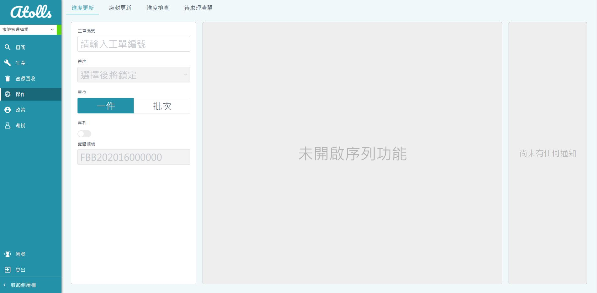
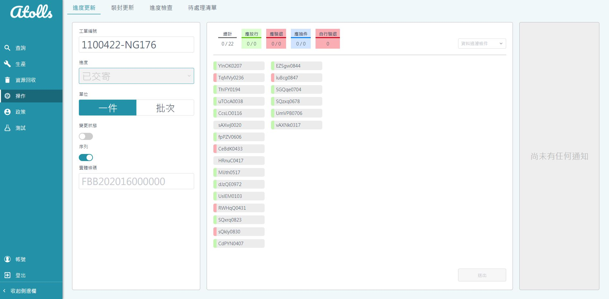

# 進度更新

## 功能說明
* 提供給工廠人員以掃條碼或手動輸入更新保單進度
* 分三個區塊
    * 操作區
    * 序列
    * 通知區

## 更新保單進度
* 輸入工單編號
    * 系統將檢查工單編號是否屬於此帳號的委外廠商
* 選擇預更新的進度
* 選擇更新單位
    * 一件 : 單本保單刷條碼後更新進度
    * 批次 : 此工單刷其中一本即可全數更新進度
* 序列功能
    * 工廠可將全數保單刷完後確認狀態無誤再提交
    * 已檢查、已交寄預設開啟
    * 限制單位只能為一件
    * 提供工單內總保單數
    * 提供已刷保單數方便檢查
    * 保單
        * 透過改變背景提示未刷 / 已刷
        * 外框色表示工單指示預刷之保單狀態
        * 左側顏色代表保單目前狀態
    * 代表色
        * 放行 - 綠色
        * 驗退 - 紅色
        * 抽件 - 藍色
    * 提交
* 通知
    * 成功 - 每1.5秒刪除一筆 
    * 失敗 - 不刪除 / 音效提醒

## 業務邏輯

* 工單編號
    * 檢查帳號所設定的委外廠商是否有這筆工單
    * 載入此工單編號的保單資料
* 進度選擇後即鎖定
    * 增加工廠人員更謹慎選擇進度
* 進度 - 已檢查
    * 單位只能一件
    * 可變更狀態為一般或驗退
    * 工廠人員如在此階段發現保單有問題可自行變更狀態驗退
    * 預設開啟序列
* 進度 - 已交寄
    * 可變更狀態為一般、抽件或驗退
    * 工廠人員如在此階段發現保單有問題可自行變更狀態驗退
    * 預設開啟序列