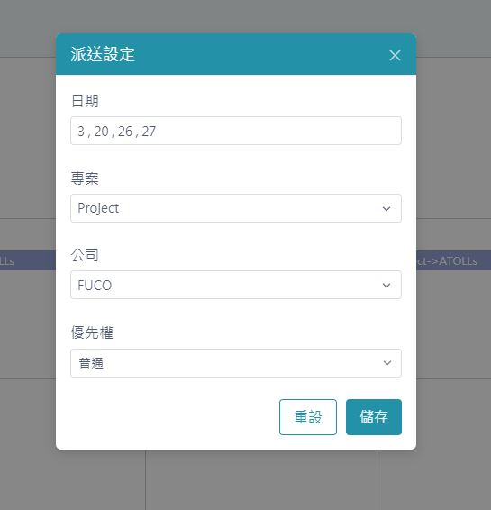
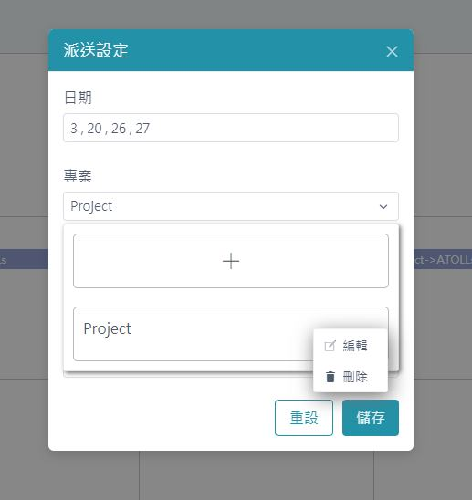
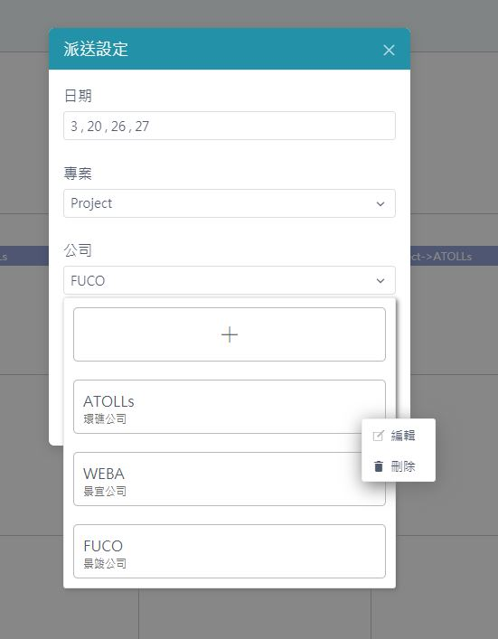
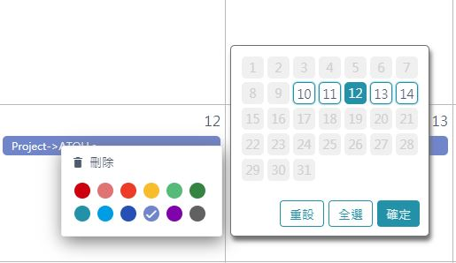
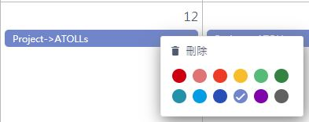

# 生產 - 派送設定

> 介面

## 功能說明
* 指定委外廠商於哪些日期負責哪個專案 (圖1)
* 可指定優先權 (圖1)
* 可管理專案 (圖2)
* 可管理委外公司 (圖3)
* 可刪除已設定之事件 (圖4)
    * `公司ID + 專案ID` 為判定同一事件之條件
    * 以外框色顯示相同事件之其他日期
    * 預設選取該天
    * 非該事件之日期為灰色不可選
* 可更改已設定之事件顏色 (圖5)
* 一天超過三個事件將顯示more字樣
    * 點選more可觀看當天全部事件
* 點選事件可顯示設定資訊
    * 專案名稱
    * 專案描述
    * 委外公司名稱
    * 委外公司別名
    * 上傳路徑
    * 下載路徑
    * IP
    * 日期

> 派送設定 (圖1) 

> 管理專案 (圖2) 

> 管理委外公司 (圖3) 

> 刪除已設定物件 (圖4) 

> 更改顏色 (圖5) 