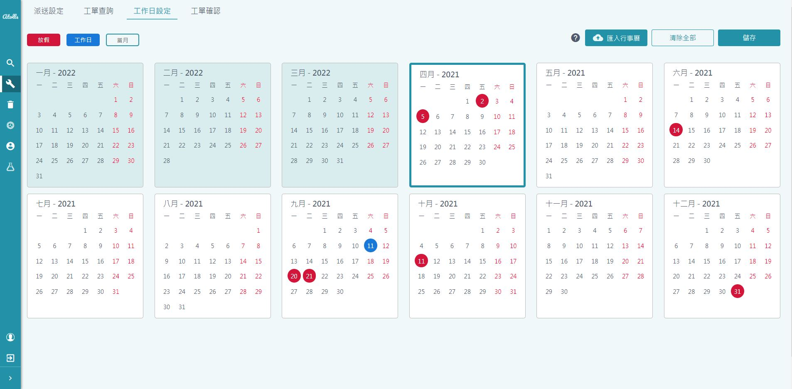
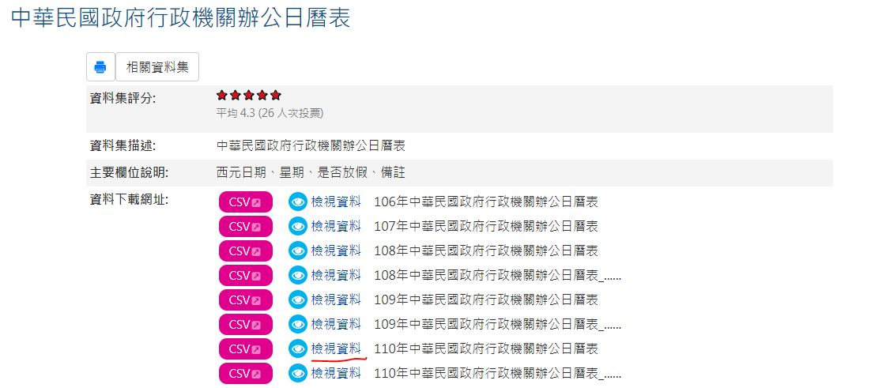
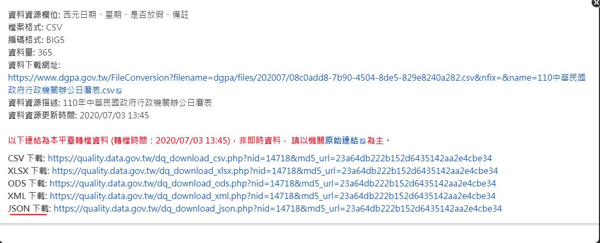

# 生產 - 工作日設定

>介面

## 功能
* 設定工作日
    * 跟工作日有關的設定將參考此設定
    *   新商品五天工作日退回
* 匯入政府行事曆
* 當月以後皆為今年之設定
* 當月以前為明年之設定 (深背景色)

## 設定工作日
* 預設周休二日
* 點擊日期
    * 原放假日 -> 工作日
    * 原工作日 -> 放假日
    * 再點一次可取消設定
* 日期格式 mmdd `0801`
    * 不分年
* 儲存後套用

## 匯入行事曆
* 目前限 i18n 為中文時啟用
* 格式
    * [行政機關辦公日曆表](https://data.gov.tw/dataset/14718) (政府open data)
    * json
    * 非 google 日歷用
* 未來有外國客戶會再討論匯入格式

> 政府open data下載

> 政府open data下載

> 資料資源描述 注意非Google日曆格式